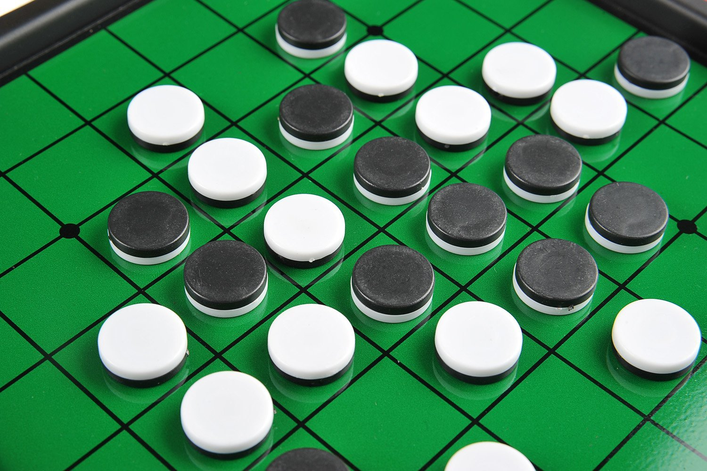
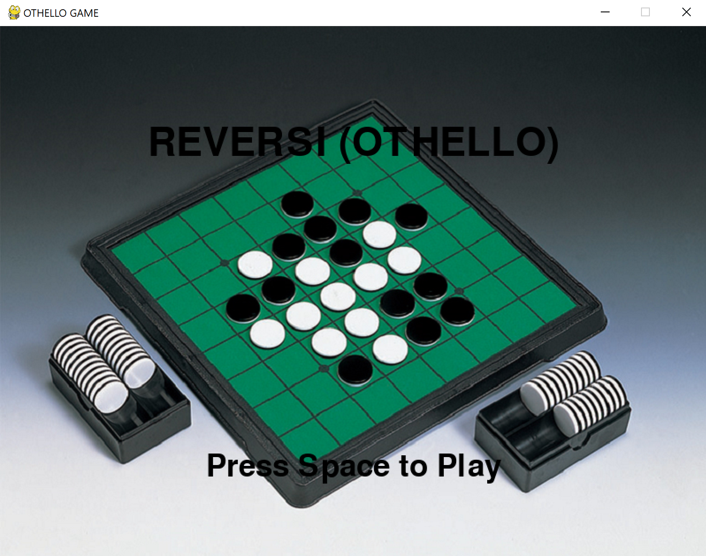
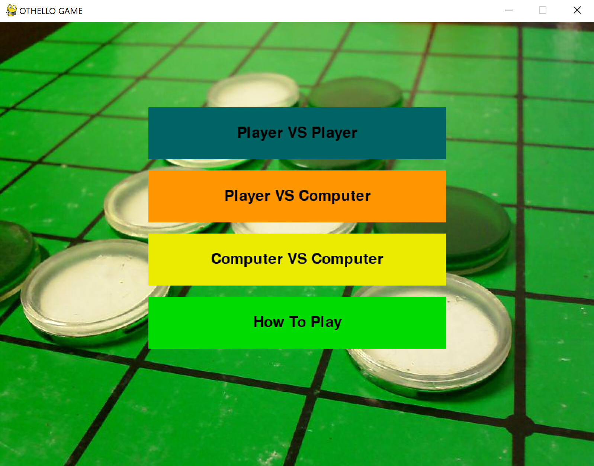
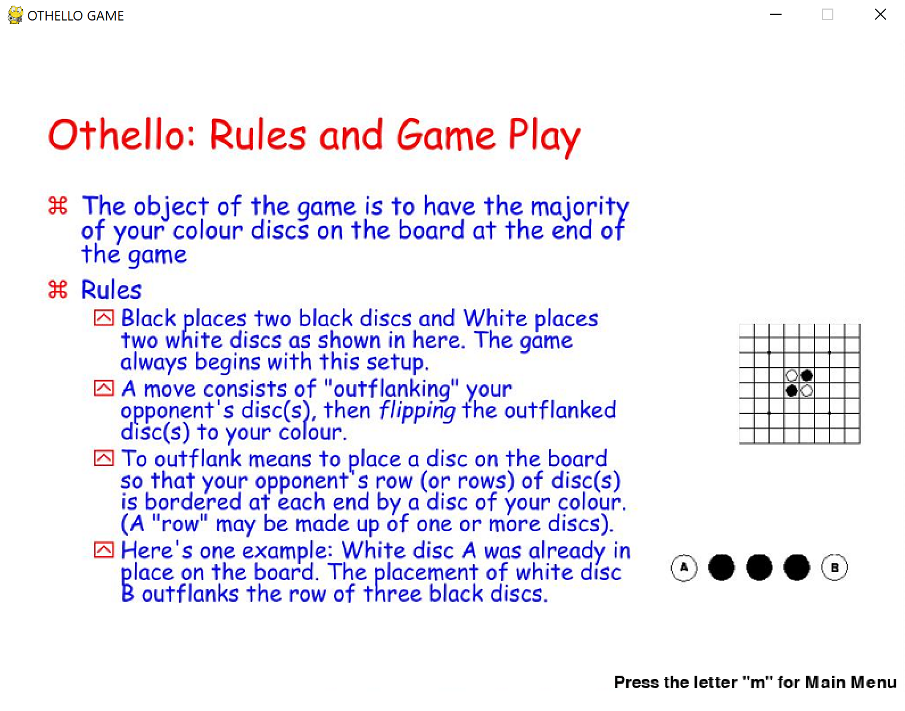
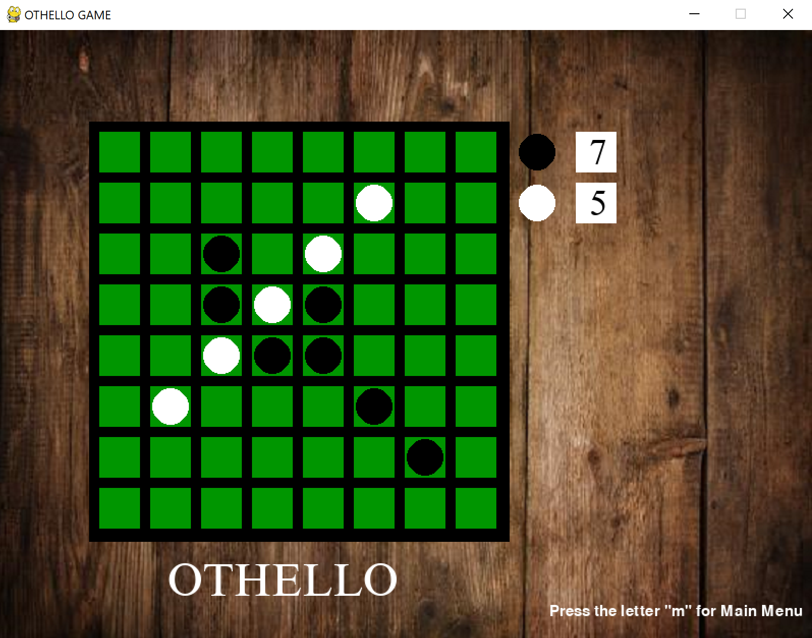
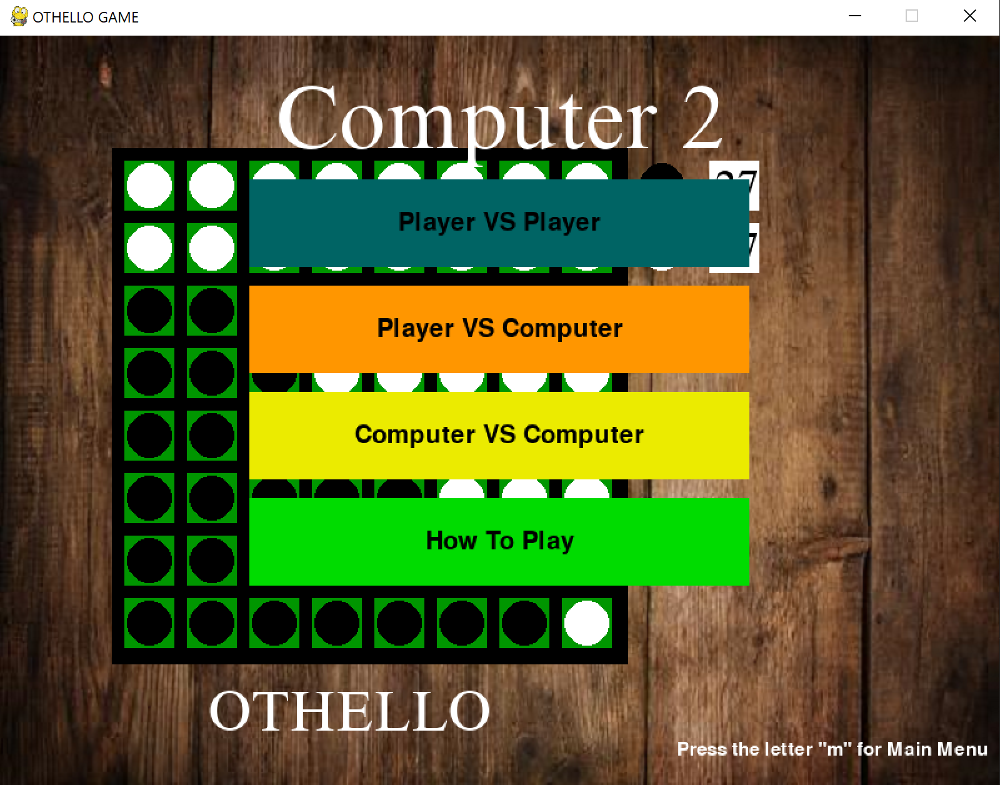

<!-- PROJECT LOGO -->
<br />
<p align="center">
  <a>
    
  </a>
  <h3 align="center">Python Othello Game</h3>
  <p align="center">
    Othello, also known as Reversi, simulated using Python.
  </p>
</p>


<!-- TABLE OF CONTENTS -->
<details open="open">
  <summary>Table of Contents</summary>
  <ol>
    <li>
      <a href="#about-the-project">About The Project</a>
      <ul>
        <li><a href="#built-with">Built With</a></li>
      </ul>
    </li>
    <li>
      <a href="#getting-started">Getting Started</a>
      <ul>
        <li><a href="#prerequisites">Prerequisites</a></li>
        <li><a href="#installation">Installation</a></li>
      </ul>
    </li>
    <li><a href="#usage">Usage</a></li>
    <li><a href="#license">License</a></li>
    <li><a href="#contact">Contact</a></li>
    <li><a href="#acknowledgements">Acknowledgements</a></li>
  </ol>
</details>


<!-- ABOUT THE PROJECT -->
## About The Project

Othello is a strategy board game for two players, played on an 8×8 uncheckered board. The pieces of the game are known as "disks" and the aim is for a player to fill the board with as many disks of their color as possible. The game is finished when the board is completely filled up, leading to no additonal legal moves. The player with the most disks on the board will be declared the winner. This project intends to replicate the board game with its complex nature along with its rules/guidelines.


Results of the project
* Designed and programmed an algorithm to detect valid moves, the final winner, and a possible tie.
* Features player vs. player, player vs. computer, and computer vs. computer gaming modes.
* Customized the Graphical User Interface to include music and background images.
* Implementaiton of a score counter which displays the number of pieces both players have on the board along with a declared winner or tie screen.

A list of commonly used resources that I found helpful are listed in the acknowledgements.

### Built With

The game was built using Python along with the additional packages: 
* [Pygame](https://www.pygame.org/docs/)
* [NumPy](https://numpy.org/doc/)
* [Random](https://docs.python.org/3/library/random.html)

Pygame was utilized to create the GUI (Graphical User Interface) for the user to interact with.

NumPy was utilized to create arrays which stored the players moves and reflected those moves onto the GUI.

Random was utilized to execute moves for the computer in modes where the computer is a competitor.


<!-- GETTING STARTED -->
## Getting Started

To get a local copy up and running follow these simple example steps.

### Prerequisites

The easiest way to install the NumPy and Pygame packages for Python is by using Pip.
* Pip
  ```sh
  sudo apt install python3-pip
  ```

### Installation

1. Install Python at [https://www.python.org/downloads/](https://www.python.org/downloads/)
2. Clone the repo
   ```sh
   git clone https://github.com/ojasonbernal/PythonOthelloGame.git
   ```
3. Install Python packages
   ```sh
   pip3 install pygame
   pip3 install numpy
   ```


<!-- USAGE EXAMPLES -->
## Usage

Upon executing the program, the user will be displayed a window which serves to the be the GUI for the board game. The user is prompted to press the space bar to play the game.



The user is prompted with the options to play player vs. player, player vs. computer, and computer vs. computer or to view the instructions of the game.



If the user chooses the "How To Play" option, they will be greeted with the following screen to help them understand how to play the game.



If the user chooses one of the gaming options, the screen will switch to the view of a board with a score counter to the side that will keep up with the game. The board view is consistent across all gaming options and the user can begin playing or viewing the game.



Once the board is filled, a winner or tie will be decided and a respective screen will be shown. The user will have the option to play again or return to the home screen.




The user can continue to play for as long as they like!


<!-- LICENSE -->
## License

Distributed under the MIT License. See `LICENSE` for more information.


<!-- CONTACT -->
## Contact

Jason Bernal - ojasonbernal@gmail.com

LinkedIn: [https://www.linkedin.com/in/ojasonbernal/](https://www.linkedin.com/in/ojasonbernal/)

Project Link: [https://github.com/ojasonbernal/PythonOthelloGame](https://github.com/ojasonbernal/PythonOthelloGame)


<!-- ACKNOWLEDGEMENTS -->
## Acknowledgements
* [Official Rules For The Game Othello](https://www.worldothello.org/about/about-othello/othello-rules/official-rules/english)
* [Othello: An Introduction to Strategy and Tactics](http://www.gaurang.org/gothello/guide/guide.html)
* [https://freemp3cloud.com/](https://freemp3cloud.com/)

### Images
* [Othello Board View](https://www.learnmathwithgames.com/wp-content/uploads/2018/06/811liThCnsL._SL1500_-750x500.jpg)
* [Othello Home Screen](https://forums.automobile-propre.com/uploads/monthly_2019_07/tsukuda.jpg.698f8953a8a2fa31a760e90d5aac28c7.jpg)
* [Othello Options Screen](https://geekoutsw.files.wordpress.com/2018/05/othello_reversi_board.jpg)
* [Othello Instructions Screen](https://image.slideserve.com/335538/othello-rules-and-game-play-n.jpg)
* [Wood Background](https://www.stockphotosecrets.com/wp-content/uploads/2018/11/dreamstime3.jpg)
